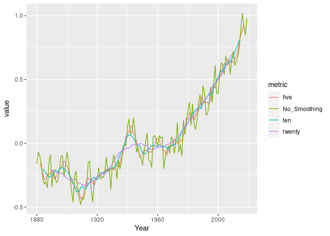

Climate Exercise
================
Keili Prenton & Kaylei Nilson

# Climate Change Analysis

## Examining CO2 trends in R

  - Example from <http://climate.nasa.gov/vital-signs/carbon-dioxide/>
  - Raw data from
    <ftp://aftp.cmdl.noaa.gov/products/trends/co2/co2_mm_mlo.txt>

<!-- end list -->

``` r
library(tidyverse)
```

``` r
co2 <- 
read_table("https://raw.githubusercontent.com/espm-157/climate-template/master/assignment/co2_mm_mlo.txt", 
                  comment="#",
                  col_names = c("year", "month", "decimal_date", "average",
                                "interpolated", "trend", "days"),
                  na = c("-1", "-99.99"))
co2
```

    ## # A tibble: 749 x 7
    ##     year month decimal_date average interpolated trend  days
    ##    <dbl> <dbl>        <dbl>   <dbl>        <dbl> <dbl> <dbl>
    ##  1  1958     3        1958.    316.         316.  315.    NA
    ##  2  1958     4        1958.    317.         317.  315.    NA
    ##  3  1958     5        1958.    318.         318.  315.    NA
    ##  4  1958     6        1958.     NA          317.  315.    NA
    ##  5  1958     7        1959.    316.         316.  315.    NA
    ##  6  1958     8        1959.    315.         315.  316.    NA
    ##  7  1958     9        1959.    313.         313.  316.    NA
    ##  8  1958    10        1959.     NA          313.  316.    NA
    ##  9  1958    11        1959.    313.         313.  315.    NA
    ## 10  1958    12        1959.    315.         315.  316.    NA
    ## # … with 739 more rows

``` r
ggplot(co2, aes(x = decimal_date, y = average)) + geom_line() 
```

<!-- -->

Which months are the CO2 values at the maximum? Minimum? Why is this? -
CO2 values are at a maximum in colder/winter months and at a minimum in
warmer months. This is because in the warmer months plants are more
active and photosynthesize more so they are pulling more CO2 from the
atmosphere compared to winter months.

What rolling average is used in computing the “trend” line? How does the
trend depend on the rolling average? - The rolling averages of monthly
CO2 levels are used to create the “trend” line. When plotted the rolling
averages show the overall trend for each year (zig-zag pattern) and for
the duration of the study (generally increasing).

-----

# Temperature Data

Each of the last years has consecutively set new records on global
climate. In this section we will analyze global mean temperature data.

Data from: <http://climate.nasa.gov/vital-signs/global-temperature>

## Question 1:

Describe the data set to the best of your ability given the
documentation provided. Describe what kind of column each data contains
and what units it is measured in. Then address our three key questions
in understanding this data:

The data set documents annual average surface temperatures from 1880 to
2019, using the averages from 1951-1980 as the base line. The fist
column defines the years of the data set which are from 1880 to 2019.
One of the columns of the data set is No\_Smooth which is the raw data
on the global surface temperature over the years. The other column is
Lowess which is data smoothing that allows the trends or patterns over
the years to show up more clearly. The No\_Smooth and Lowess columns are
measured in degrees celsius units.

  - How are the measurements made? What is the associated measurement
    uncertainty? -Data on temperatures is collected from NASA’s
    metrological stations and ocean areas. Error in incomplete spatial
    and temporal variations may contribute to uncertainty. Additionally,
    some of the metrological stations encounter urban warming which
    could also contibute to uncertainty in the accuracy of these
    measurements; however, other methods are used to try to account for
    this.

  - What is the resolution of the data?

  - Are their missing values? How should they be handled?

## Question 2:

Construct the necessary R code to import and prepare for manipulation
the following data set:
<http://climate.nasa.gov/system/internal_resources/details/original/647_Global_Temperature_Data_File.txt>

``` r
temp<- read_table("http://climate.nasa.gov/system/internal_resources/details/original/647_Global_Temperature_Data_File.txt", 
                  skip = 5,
                  col_names = c("Year", "No_Smoothing", "Lowess"))
```

    ## Parsed with column specification:
    ## cols(
    ##   Year = col_double(),
    ##   No_Smoothing = col_double(),
    ##   Lowess = col_double()
    ## )

``` r
temp
```

    ## # A tibble: 140 x 3
    ##     Year No_Smoothing Lowess
    ##    <dbl>        <dbl>  <dbl>
    ##  1  1880        -0.16  -0.08
    ##  2  1881        -0.07  -0.12
    ##  3  1882        -0.1   -0.16
    ##  4  1883        -0.17  -0.19
    ##  5  1884        -0.28  -0.23
    ##  6  1885        -0.32  -0.25
    ##  7  1886        -0.3   -0.26
    ##  8  1887        -0.35  -0.26
    ##  9  1888        -0.16  -0.26
    ## 10  1889        -0.09  -0.25
    ## # … with 130 more rows

## Question 3:

Plot the trend in global mean temperatures over time. Describe what you
see in the plot and how you interpret the patterns you observe.

``` r
temp %>%
  ggplot(aes(x=Year)) +
  geom_line(aes(y=No_Smoothing), col ="blue") +
  geom_line(aes(y=Lowess), col="green", size = 1.3) 
```

<!-- --> While
there are ups and downs over the years, there is a general increase in
average global temperature. There is a steep increase in the rate of
global warming beginning in the later half of the 1900s. This trend is
roughly seen with he raw, unsmoothed data (shown in blue) and in
confirmed with the smoothed data (shown in green).

## Question 4: Evaluating the evidence for a “Pause” in warming?

The [2013 IPCC
Report](https://www.ipcc.ch/pdf/assessment-report/ar5/wg1/WG1AR5_SummaryVolume_FINAL.pdf)
included a tentative observation of a “much smaller increasing trend” in
global mean temperatures since 1998 than was observed previously. This
led to much discussion in the media about the existence of a “Pause” or
“Hiatus” in global warming rates, as well as much research looking
into where the extra heat could have gone. (Examples discussing this
question include articles in [The
Guardian](http://www.theguardian.com/environment/2015/jun/04/global-warming-hasnt-paused-study-finds),
[BBC News](http://www.bbc.com/news/science-environment-28870988), and
[Wikipedia](https://en.wikipedia.org/wiki/Global_warming_hiatus)).

By examining the data here, what evidence do you find or not find for
such a pause? Present an analysis of this data (using the tools &
methods we have covered in Foundation course so far) to argue your case.

What additional analyses or data sources would better help you refine
your
arguments?

``` r
pause<- read_table("http://climate.nasa.gov/system/internal_resources/details/original/647_Global_Temperature_Data_File.txt", 
                  skip = 110,
                  col_names = c("Year", "No_Smoothing", "Lowess"))
```

    ## Parsed with column specification:
    ## cols(
    ##   Year = col_double(),
    ##   No_Smoothing = col_double(),
    ##   Lowess = col_double()
    ## )

``` r
pause
```

    ## # A tibble: 35 x 3
    ##     Year No_Smoothing Lowess
    ##    <dbl>        <dbl>  <dbl>
    ##  1  1985         0.11   0.22
    ##  2  1986         0.18   0.24
    ##  3  1987         0.32   0.27
    ##  4  1988         0.38   0.3 
    ##  5  1989         0.27   0.33
    ##  6  1990         0.45   0.33
    ##  7  1991         0.4    0.32
    ##  8  1992         0.22   0.33
    ##  9  1993         0.23   0.33
    ## 10  1994         0.31   0.34
    ## # … with 25 more rows

``` r
pause_subset <- pause[c(18:29), c(1,3)]
pause_subset
```

    ## # A tibble: 12 x 2
    ##     Year Lowess
    ##    <dbl>  <dbl>
    ##  1  2002   0.55
    ##  2  2003   0.59
    ##  3  2004   0.61
    ##  4  2005   0.62
    ##  5  2006   0.63
    ##  6  2007   0.63
    ##  7  2008   0.64
    ##  8  2009   0.64
    ##  9  2010   0.65
    ## 10  2011   0.66
    ## 11  2012   0.7 
    ## 12  2013   0.74

``` r
ggplot()+geom_line(data=pause, aes(x=Year,y=Lowess), col="Blue")+geom_line(data=pause_subset, aes(x=Year, y=Lowess), col ="Green", size = 1.5)
```

<!-- --> When
looking at all the data the overall increasing trend is easy to see.
However, if only recent data is taken into account (up to 2013 when the
claims were made) there looks like there is a plateau is overall
warming. Highlighted in green, the decade leading up to 2013 experienced
minimal warming but directly outside of that time boundary the dramatic
increasing trend is still seen. The claim that there was a “pause” is
technically correct, as seen with the plateau in global temperature
increase. This does not mean the global warming has stopped.

Overall there was a temporary pause in the drastic rate of global
warming seen prior to the early 2000s. Further anaylsis of the rate of
increase can be done to confirm this. However, this does not indicate
any permanent pause or validation that efforts to mitigate climate
change can be stopped. When looking at the overall trend of warming, the
years leading up to the 2000s and 2010s, and other “pauses” in climate
change show that the short “pause” noticed in 2013 doesn’t mean anything
significant in climate change efforts.

## Question 5: Rolling averages

  - What is the meaning of “5 year average” vs “annual average”?
      - A 5 year average averages annual average over 5 year periods and
        plot those points. Annual averages average smaller time periods
        (i.e monthly) data and produce an aveage for that year.
  - Construct 5 year averages from the annual data. Construct 10 &
    20-year averages.

<!-- end list -->

``` r
library(zoo)
```

    ## 
    ## Attaching package: 'zoo'

    ## The following objects are masked from 'package:base':
    ## 
    ##     as.Date, as.Date.numeric

``` r
rolling <- temp %>%
  select(Year, No_Smoothing) %>%
  mutate(five = rollmean(No_Smoothing, k = 5, fill=NA),
         ten = rollmean(No_Smoothing, k = 10, fill=NA),
         twenty = rollmean(No_Smoothing, k = 20, fill=NA))

rolling
```

    ## # A tibble: 140 x 5
    ##     Year No_Smoothing   five    ten twenty
    ##    <dbl>        <dbl>  <dbl>  <dbl>  <dbl>
    ##  1  1880        -0.16 NA     NA     NA    
    ##  2  1881        -0.07 NA     NA     NA    
    ##  3  1882        -0.1  -0.156 NA     NA    
    ##  4  1883        -0.17 -0.188 NA     NA    
    ##  5  1884        -0.28 -0.234 -0.2   NA    
    ##  6  1885        -0.32 -0.284 -0.218 NA    
    ##  7  1886        -0.3  -0.282 -0.233 NA    
    ##  8  1887        -0.35 -0.244 -0.249 NA    
    ##  9  1888        -0.16 -0.248 -0.263 NA    
    ## 10  1889        -0.09 -0.232 -0.264 -0.213
    ## # … with 130 more rows

  - Plot the different averages and describe what differences you see
    and why.

<!-- end list -->

``` r
rolling %>%
  gather(metric, value, No_Smoothing:twenty) %>%
  ggplot(aes(Year, value, color = metric))+ geom_line()
```

    ## Warning: Removed 32 row(s) containing missing values (geom_path).

<!-- -->

As larger averages are taken the smoother the data gets. By taking the
average over a period of time, outlier values are slowly removed leading
to less eratic overall averages. Although less of a complete view of the
data, taking these rolling averages allows for general trends to easily
be identified and visualized.

# Exercise II: Melting Ice Sheets?

  - Data description: <http://climate.nasa.gov/vital-signs/land-ice/>
  - Raw data file:
    <http://climate.nasa.gov/system/internal_resources/details/original/499_GRN_ANT_mass_changes.csv>

## Question 1:

  - Describe the data set: what are the columns and units? Where do the
    numbers come from?
      - The data consists of a year column, an Antarctic ice sheet mass
        column, and a Greenland ice sheet mass column. The years are
        broken down to decimal values, thus is the values are at a finer
        scale then annual measurements. The mass columns look at
        gigatonnes of mass of the respective area’s ice sheets.
  - What is the uncertainty in measurment? Resolution of the data?
    Interpretation of missing values?
      - Although the resolution of the data goes down to decimals there
        is still uncertainty in what happens in the time between
        measurements as well as the complete accuracy of the mass
        measurements. There doesn’t seem to be missing values.

## Question 2:

Construct the necessary R code to import this data set as a tidy `Table`
object.

``` r
ice_sheets <- read_csv("http://climate.nasa.gov/system/internal_resources/details/original/499_GRN_ANT_mass_changes.csv", 
                  skip = 10,
                  col_names = c("time", "greenland_mass", "antarctica_mass"))
```

    ## Parsed with column specification:
    ## cols(
    ##   time = col_double(),
    ##   greenland_mass = col_double(),
    ##   antarctica_mass = col_double()
    ## )

``` r
ice_sheets
```

    ## # A tibble: 140 x 3
    ##     time greenland_mass antarctica_mass
    ##    <dbl>          <dbl>           <dbl>
    ##  1 2002.          1491.            967.
    ##  2 2002.          1486.            979.
    ##  3 2003.          1287.            512.
    ##  4 2003.          1258.            859.
    ##  5 2003.          1257.            694.
    ##  6 2003.          1288.            592.
    ##  7 2003.          1337.            658.
    ##  8 2003.          1354.            477.
    ##  9 2003.          1363.            546.
    ## 10 2003.          1427.            494.
    ## # … with 130 more rows

## Question 3:

Plot the data and describe the trends you observe.

``` r
ice_sheets %>%
  gather(location,mass, greenland_mass, antarctica_mass) %>% 
  ggplot(aes(x=time, y=mass, col = location)) + geom_line()
```

<!-- --> Both
ice sheets have been rapidly diminishing from the start of the data
collection of this set. Both experience increases and decreases but have
a general decreasing trend. The Greenland ice sheet is experiencing a
faster rate of decrease than the Antarctic ice sheet.

# Exercise III: Rising Sea Levels?

  - Data description: <http://climate.nasa.gov/vital-signs/sea-level/>
  - Raw data file:
    <http://climate.nasa.gov/system/internal_resources/details/original/121_Global_Sea_Level_Data_File.txt>

## Question 1:

  - Describe the data set: what are the columns and units?
  - Where do these data come from?
  - What is the uncertainty in measurment? Resolution of the data?
    Interpretation of missing values?

The data set looks at the average global sea level variation over the
years and portions of a year (years measured to the decimal place). Sea
level is measured in mm, starting in 1993. There are various iterations
of the raw data, that smooth it out. Standard deviations and other
statistics (i.e number of observations) are also included. Measurements
are collected by both ground level gauges and satellitles. There does
not seem to any missing values. Uncertainty comes from sea level
variability and possible inaccuracy in measurement. The uncertainty
value is +/- 4mm.

## Question 2:

Construct the necessary R code to import this data set as a tidy `Table`
object.

``` r
sea_levels_raw <- read_table("http://climate.nasa.gov/system/internal_resources/details/original/121_Global_Sea_Level_Data_File.txt", 
                  skip = 45,
                  col_names = c("frequency_type", "merged_file_cycle_number", "year","no_of_obs","no_of_weighted_obs","GMSL_variation_noGIA","SD_GMSL_variation_noGIA","smoothed_GMSL_variation_noGIA","GMSL_variation_withGIA","SD_GMSL_variation_withGIA","smoothed_GMSL_variation_withGIA","smoothed_GMSL_variation_withGIA_nosignal"))
```

    ## Parsed with column specification:
    ## cols(
    ##   frequency_type = col_double(),
    ##   merged_file_cycle_number = col_double(),
    ##   year = col_double(),
    ##   no_of_obs = col_double(),
    ##   no_of_weighted_obs = col_double(),
    ##   GMSL_variation_noGIA = col_double(),
    ##   SD_GMSL_variation_noGIA = col_double(),
    ##   smoothed_GMSL_variation_noGIA = col_double(),
    ##   GMSL_variation_withGIA = col_double(),
    ##   SD_GMSL_variation_withGIA = col_double(),
    ##   smoothed_GMSL_variation_withGIA = col_double(),
    ##   smoothed_GMSL_variation_withGIA_nosignal = col_double()
    ## )

``` r
sea_levels_raw
```

    ## # A tibble: 847 x 12
    ##    frequency_type merged_file_cyc…  year no_of_obs no_of_weighted_…
    ##             <dbl>            <dbl> <dbl>     <dbl>            <dbl>
    ##  1              0               11 1993.    463892          336485.
    ##  2              0               12 1993.    458154          333208.
    ##  3              0               13 1993.    469524          341593.
    ##  4              0               14 1993.    419112          305335.
    ##  5              0               15 1993.    456793          330244.
    ##  6              0               16 1993.    414055          299600.
    ##  7              0               17 1993.    465235          336243.
    ##  8              0               18 1993.    463257          334575.
    ##  9              0               19 1993.    458542          330751.
    ## 10            999               20 1993.    464921          339267.
    ## # … with 837 more rows, and 7 more variables: GMSL_variation_noGIA <dbl>,
    ## #   SD_GMSL_variation_noGIA <dbl>, smoothed_GMSL_variation_noGIA <dbl>,
    ## #   GMSL_variation_withGIA <dbl>, SD_GMSL_variation_withGIA <dbl>,
    ## #   smoothed_GMSL_variation_withGIA <dbl>,
    ## #   smoothed_GMSL_variation_withGIA_nosignal <dbl>

``` r
sea_levels<-sea_levels_raw[c(1:847),c(3,12)]
sea_levels
```

    ## # A tibble: 847 x 2
    ##     year smoothed_GMSL_variation_withGIA_nosignal
    ##    <dbl>                                    <dbl>
    ##  1 1993.                                   -14.1 
    ##  2 1993.                                   -14.7 
    ##  3 1993.                                   -14.2 
    ##  4 1993.                                   -14.2 
    ##  5 1993.                                   -13.0 
    ##  6 1993.                                   -11.8 
    ##  7 1993.                                   -10.6 
    ##  8 1993.                                    -9.73
    ##  9 1993.                                    -9.12
    ## 10 1993.                                    -8.76
    ## # … with 837 more rows

## Question 3:

Plot the data and describe the trends you
observe.

``` r
ggplot(sea_levels, aes(x = year, y = smoothed_GMSL_variation_withGIA_nosignal)) + geom_line()
```

<!-- -->
Despite local increases and decreases there is an overall, drastic
increase in global mean sea levels. The most refined data column is used
to calculate the graph above and is shown in red below. Even in the less
smooth iterations of the data, the same general increasing trend is
still seen. See below for the other iterations shown with the GMSL
variation (smoothed, with GIA, signal removed) seen above.

``` r
sea_levels_raw %>%
  ggplot(aes(x=year)) +
  geom_line(aes(y=GMSL_variation_noGIA)) +
  geom_line(aes(y=smoothed_GMSL_variation_noGIA))+
  geom_line(aes(y=GMSL_variation_withGIA))+
  geom_line(aes(y=smoothed_GMSL_variation_withGIA))+
  geom_line(aes(y=smoothed_GMSL_variation_withGIA_nosignal), col= "red", size = 1.25)
```

<!-- -->

# Exercise IV: Arctic Sea Ice?

  - <http://nsidc.org/data/G02135>
  - <ftp://sidads.colorado.edu/DATASETS/NOAA/G02135/north/daily/data/N_seaice_extent_daily_v3.0.csv>

## Question 1:

  - Describe the data set: what are the columns and units?

  - Where do these data come from?

  - What is the uncertainty in measurement? Resolution of the data?
    Interpretation of missing values?

  - This data looks at changes in sea ice extent in the Arctic and
    Antarctic. Sea ice extent describes how much of the ocean is covered
    in a layer of ice. The data displays the day, month, and year for
    each data recording. The data set includes data from November 1978
    to present day. The data includes columns “extent,” and “missing,”
    which are recorded in 10^6 sq km. The column “extent” is the data
    used to visualize the change in the sea ice layer.

  - This data comes from the National Snow and Ice Data Center and the
    data contributers listed are Florence Fetter, Kenneth Knowles,
    Walter Meier, Matthew Savoie, and Ann Windnagel.

  - The data provides daily and monthly entries, but the day-to-day
    variations are often more uncertain because they are the result of
    short-term weather. The solution to this is to give more
    consideration to monthly averages which are better for long-term
    trend analysis. The spatial resolution of the data is 25 km x 25 km.
    The missing column has 0 inputs.

## Question 2:

Construct the necessary R code to import this data set as a tidy `Table`
object.

``` r
sea_ice_raw <- read_csv("N_seaice_extent_daily_v3.0.csv",
                  skip= 2,
                  col_names = c("Year", "Month", "Day", "Extent", "Missing", "Source Data"))
```

    ## Parsed with column specification:
    ## cols(
    ##   Year = col_double(),
    ##   Month = col_double(),
    ##   Day = col_double(),
    ##   Extent = col_double(),
    ##   Missing = col_double(),
    ##   `Source Data` = col_character()
    ## )

``` r
sea_ice_raw
```

    ## # A tibble: 13,646 x 6
    ##     Year Month   Day Extent Missing `Source Data`                               
    ##    <dbl> <dbl> <dbl>  <dbl>   <dbl> <chr>                                       
    ##  1  1978    10    26   10.2       0 ['/ecs/DP1/PM/NSIDC-0051.001/1978.10.26/nt_…
    ##  2  1978    10    28   10.4       0 ['/ecs/DP1/PM/NSIDC-0051.001/1978.10.28/nt_…
    ##  3  1978    10    30   10.6       0 ['/ecs/DP1/PM/NSIDC-0051.001/1978.10.30/nt_…
    ##  4  1978    11     1   10.7       0 ['/ecs/DP1/PM/NSIDC-0051.001/1978.11.01/nt_…
    ##  5  1978    11     3   10.8       0 ['/ecs/DP1/PM/NSIDC-0051.001/1978.11.03/nt_…
    ##  6  1978    11     5   11.0       0 ['/ecs/DP1/PM/NSIDC-0051.001/1978.11.05/nt_…
    ##  7  1978    11     7   11.1       0 ['/ecs/DP1/PM/NSIDC-0051.001/1978.11.07/nt_…
    ##  8  1978    11     9   11.2       0 ['/ecs/DP1/PM/NSIDC-0051.001/1978.11.09/nt_…
    ##  9  1978    11    11   11.3       0 ['/ecs/DP1/PM/NSIDC-0051.001/1978.11.11/nt_…
    ## 10  1978    11    13   11.5       0 ['/ecs/DP1/PM/NSIDC-0051.001/1978.11.13/nt_…
    ## # … with 13,636 more rows

``` r
sea_ice_raw_date <- sea_ice_raw %>% 
  mutate(date = as.Date(paste(Year, Month, Day,sep="-"))) 
sea_ice_raw_date
```

    ## # A tibble: 13,646 x 7
    ##     Year Month   Day Extent Missing `Source Data`                     date      
    ##    <dbl> <dbl> <dbl>  <dbl>   <dbl> <chr>                             <date>    
    ##  1  1978    10    26   10.2       0 ['/ecs/DP1/PM/NSIDC-0051.001/197… 1978-10-26
    ##  2  1978    10    28   10.4       0 ['/ecs/DP1/PM/NSIDC-0051.001/197… 1978-10-28
    ##  3  1978    10    30   10.6       0 ['/ecs/DP1/PM/NSIDC-0051.001/197… 1978-10-30
    ##  4  1978    11     1   10.7       0 ['/ecs/DP1/PM/NSIDC-0051.001/197… 1978-11-01
    ##  5  1978    11     3   10.8       0 ['/ecs/DP1/PM/NSIDC-0051.001/197… 1978-11-03
    ##  6  1978    11     5   11.0       0 ['/ecs/DP1/PM/NSIDC-0051.001/197… 1978-11-05
    ##  7  1978    11     7   11.1       0 ['/ecs/DP1/PM/NSIDC-0051.001/197… 1978-11-07
    ##  8  1978    11     9   11.2       0 ['/ecs/DP1/PM/NSIDC-0051.001/197… 1978-11-09
    ##  9  1978    11    11   11.3       0 ['/ecs/DP1/PM/NSIDC-0051.001/197… 1978-11-11
    ## 10  1978    11    13   11.5       0 ['/ecs/DP1/PM/NSIDC-0051.001/197… 1978-11-13
    ## # … with 13,636 more rows

``` r
avg_extent <- summarise(
    group_by (sea_ice_raw_date, Year),
    avg_extent= mean(Extent))
```

    ## `summarise()` ungrouping output (override with `.groups` argument)

``` r
avg_extent
```

    ## # A tibble: 43 x 2
    ##     Year avg_extent
    ##    <dbl>      <dbl>
    ##  1  1978       12.5
    ##  2  1979       12.3
    ##  3  1980       12.3
    ##  4  1981       12.1
    ##  5  1982       12.4
    ##  6  1983       12.3
    ##  7  1984       11.9
    ##  8  1985       12.0
    ##  9  1986       12.2
    ## 10  1987       11.4
    ## # … with 33 more rows

## Question 3:

Plot the data and describe the trends you observe.

``` r
avg_extent %>%
  ggplot(aes(x=Year , y=avg_extent)) + geom_line() 
```

<!-- -->

This graph depicts sea ice extent change over the years 1980-2020. The
data set provides daily and monthly reccordings; however, I averaged
each year’s data information so that the trend in the graph was easier
to see. As the visualization shows, the average sea ice extent per year
has been declining, with a substative decline occuring between
2000-2010. In 2020, the sea ice extent appears to be increasing. I
believe this could be due to awareness of the sea ice extent declining
and collaborative efforts by researchers and policy makers to try to
defy this trend and restore sea ice extent.

# Exercise V: Longer term trends in CO2 Records

The data we analyzed in the unit introduction included CO2 records
dating back only as far as the measurements at the Manua Loa
observatory. To put these values into geological perspective requires
looking back much farther than humans have been monitoring atmosopheric
CO2 levels. To do this, we need another approach.

[Ice core data](http://cdiac.ornl.gov/trends/co2/ice_core_co2.html):

Vostok Core, back to 400,000 yrs before present day

  - Description of data set:
    <http://cdiac.esd.ornl.gov/trends/co2/vostok.html>
  - Data source:
    <http://cdiac.ornl.gov/ftp/trends/co2/vostok.icecore.co2>

## Questions / Tasks:

  - Describe the data set: what are the columns and units? Where do the
    numbers come from?

  - What is the uncertainty in measurment? Resolution of the data?
    Interpretation of missing values?

  - Read in and prepare data for
analysis.

<!-- end list -->

``` r
Co <- read_tsv("https://cdiac.ess-dive.lbl.gov/ftp/trends/co2/vostok.icecore.co2",
                  skip=21, 
                  col_names= c("Depth(m)", "Age_of_the_ice(yrBP)", "Mean_age_of _the_air(yrBP)", "Co2_concentration(ppmv)"))
```

    ## Parsed with column specification:
    ## cols(
    ##   `Depth(m)` = col_double(),
    ##   `Age_of_the_ice(yrBP)` = col_double(),
    ##   `Mean_age_of _the_air(yrBP)` = col_double(),
    ##   `Co2_concentration(ppmv)` = col_double()
    ## )

``` r
Co
```

    ## # A tibble: 363 x 4
    ##    `Depth(m)` `Age_of_the_ice(yrB… `Mean_age_of _the_air(… `Co2_concentration(p…
    ##         <dbl>                <dbl>                   <dbl>                 <dbl>
    ##  1       149.                 5679                    2342                  285.
    ##  2       173.                 6828                    3634                  273.
    ##  3       177.                 7043                    3833                  268.
    ##  4       229.                 9523                    6220                  262.
    ##  5       250.                10579                    7327                  255.
    ##  6       266                 11334                    8113                  260.
    ##  7       303.                13449                   10123                  262.
    ##  8       321.                14538                   11013                  264.
    ##  9       332.                15208                   11326                  245.
    ## 10       342.                15922                   11719                  238.
    ## # … with 353 more rows

  - Reverse the ordering to create a chronological record.  
  - Plot data

<!-- end list -->

``` r
chron <- Co %>% arrange(desc(`Age_of_the_ice(yrBP)`))
chron
```

    ## # A tibble: 363 x 4
    ##    `Depth(m)` `Age_of_the_ice(yrB… `Mean_age_of _the_air(… `Co2_concentration(p…
    ##         <dbl>                <dbl>                   <dbl>                 <dbl>
    ##  1      3304.               419328                  417160                  278.
    ##  2      3301.               417638                  415434                  287.
    ##  3      3299.               416332                  414085                  286.
    ##  4      3293.               413010                  410831                  276.
    ##  5      3289.               411202                  409022                  281.
    ##  6      3289.               411202                  409022                  284.
    ##  7      3284.               408236                  405844                  280.
    ##  8      3274.               403173                  400390                  278 
    ##  9      3271.               401423                  398554                  277.
    ## 10      3268.               399733                  396713                  275.
    ## # … with 353 more rows

``` r
chron %>%
  ggplot(aes(x=`Age_of_the_ice(yrBP)` , y=`Co2_concentration(ppmv)`)) + geom_line() 
```

<!-- -->

``` r
chron_renamed <- mutate(chron, year = `Age_of_the_ice(yrBP)` * (-1))
ice_age_co2 <- chron_renamed %>% select (year, `Co2_concentration(ppmv)`)
ice_age_co2
```

    ## # A tibble: 363 x 2
    ##       year `Co2_concentration(ppmv)`
    ##      <dbl>                     <dbl>
    ##  1 -419328                      278.
    ##  2 -417638                      287.
    ##  3 -416332                      286.
    ##  4 -413010                      276.
    ##  5 -411202                      281.
    ##  6 -411202                      284.
    ##  7 -408236                      280.
    ##  8 -403173                      278 
    ##  9 -401423                      277.
    ## 10 -399733                      275.
    ## # … with 353 more rows

``` r
co2_renamed <- mutate(co2, `Co2_concentration(ppmv)`= average)
maunaloa_co2 <- co2_renamed %>% select (year, `Co2_concentration(ppmv)`)
maunaloa_co2
```

    ## # A tibble: 749 x 2
    ##     year `Co2_concentration(ppmv)`
    ##    <dbl>                     <dbl>
    ##  1  1958                      316.
    ##  2  1958                      317.
    ##  3  1958                      318.
    ##  4  1958                       NA 
    ##  5  1958                      316.
    ##  6  1958                      315.
    ##  7  1958                      313.
    ##  8  1958                       NA 
    ##  9  1958                      313.
    ## 10  1958                      315.
    ## # … with 739 more rows

  - Consider various smoothing windowed averages of the data.
  - Join this series to Mauna Loa data

<!-- end list -->

``` r
combined <- rbind(ice_age_co2, maunaloa_co2)
combined
```

    ## # A tibble: 1,112 x 2
    ##       year `Co2_concentration(ppmv)`
    ##      <dbl>                     <dbl>
    ##  1 -419328                      278.
    ##  2 -417638                      287.
    ##  3 -416332                      286.
    ##  4 -413010                      276.
    ##  5 -411202                      281.
    ##  6 -411202                      284.
    ##  7 -408236                      280.
    ##  8 -403173                      278 
    ##  9 -401423                      277.
    ## 10 -399733                      275.
    ## # … with 1,102 more rows

  - Plot joined data

<!-- end list -->

``` r
combined %>%
  ggplot(aes(x=`year` , y=`Co2_concentration(ppmv)`)) + geom_line() 
```

<!-- -->

  - Describe your conclusions This visualization combines both the Mauna
    Loa and Ice Core data sets to show a continuation of the Co2
    concentrations over the years. This allows us to see the general
    trend of Co2 concentration throughout history. As discussed earlier,
    the up and down trends of Co2 concentration occur in different
    seasons when plants are either photosynthesizing more or less during
    those seasons. This graph depicts an abnormal increase in Co2
    concentration during present day time. This shift is likely due to
    human causes that have disrupted the natural cycles.
